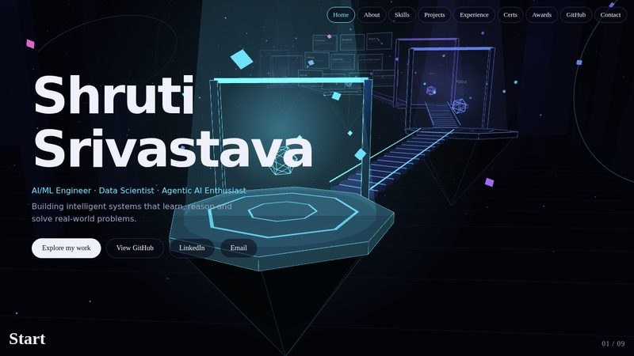
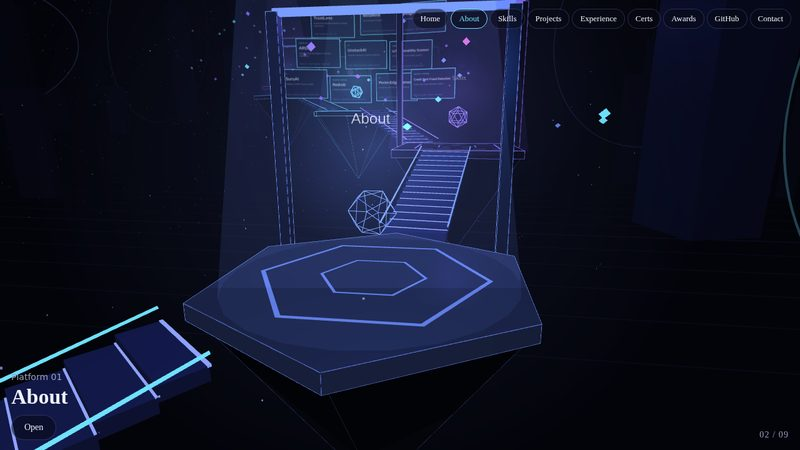
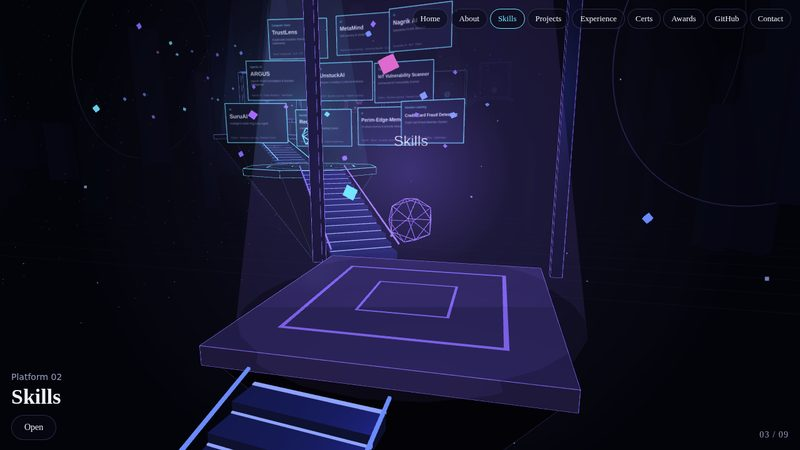
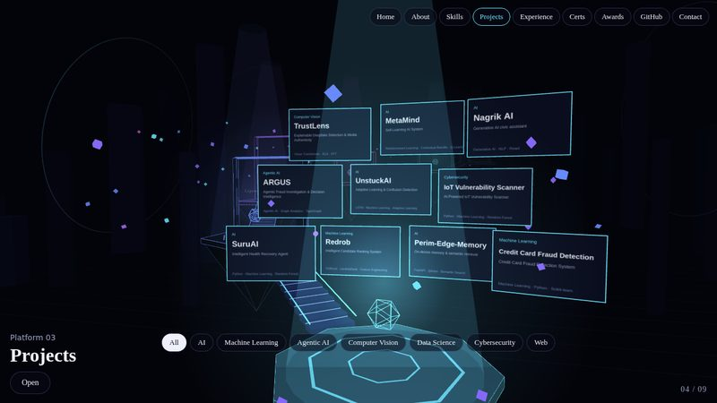
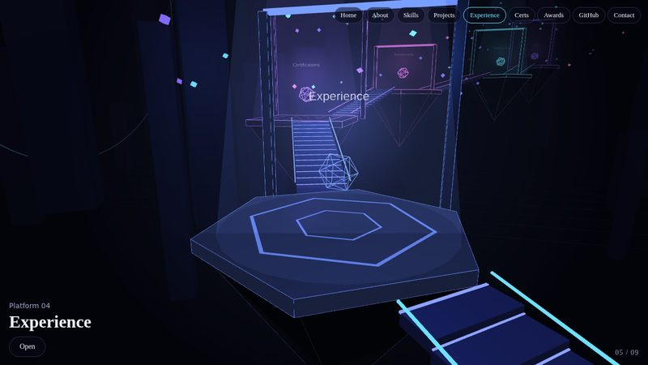
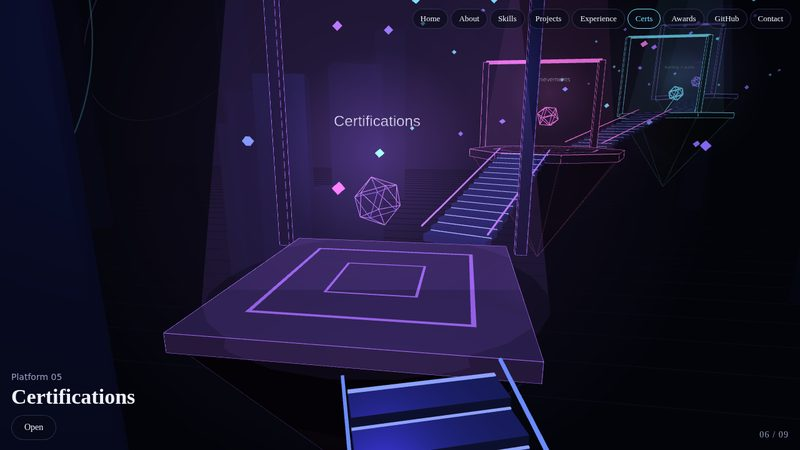
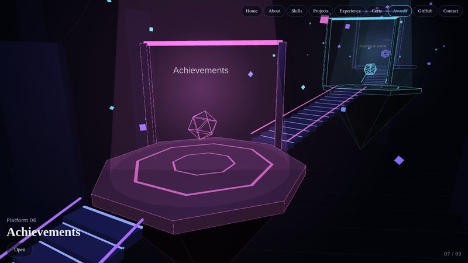
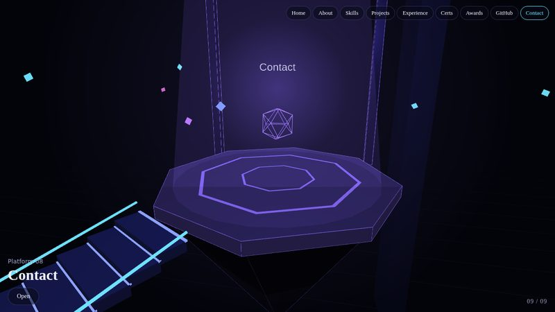

# Shruti Srivastava — AI Journey World

An immersive 3D portfolio for an AI/ML engineer. Scroll to fly the camera through nine floating platforms joined by staircases. Click a platform to open its details, or click a floating project card in the Projects area.

## Preview

<table width="100%">
<tr>
<td align="center"><br><sub>Home</sub></td>
<td align="center"><br><sub>About</sub></td>
<td align="center"><br><sub>Skills</sub></td>
<td align="center"><br><sub>Projects</sub></td>
</tr>
<tr>
<td align="center"><br><sub>Experience</sub></td>
<td align="center"><br><sub>Certifications</sub></td>
<td align="center"><br><sub>Achievements</sub></td>
<td align="center"><br><sub>Contact</sub></td>
</tr>
</table>

## Features

- Loading screen, then an intro video, then the 3D world
- Scroll-driven camera journey through nine platforms (Start, About, Skills, Projects, Experience, Certifications, Achievements, Building in public, Contact)
- Project cards placed in 3D space, with category filters (All, AI, Machine Learning, Agentic AI, Computer Vision, Data Science, Cybersecurity, Web)
- Lighting that reacts to hover, current platform and mouse position
- Mobile layout (swipeable menu, bottom-sheet panels), keyboard navigation (arrow keys, Esc) and reduced-motion support

## Files

| File | What it is |
| --- | --- |
| `index.html` | The whole site. All content lives in the `D` object at the top of the script |
| `intro.mp4` | Intro video shown after "Enter world". Replace it with your own file of the same name |
| `three.min.js` | Three.js r128, bundled so the 3D world works offline |
| `screenshots/` | Images used in this README |

## Run it

Open `index.html` in a browser, or upload the folder to GitHub Pages, Netlify or Vercel.

If the video does not play with sound when opened as a file, start a local server in this folder and open the address it prints:

```
python -m http.server
```

## Edit your content

Everything is in the `D` object in `index.html`: projects, skills, experience, certifications, achievements and social links. Project cards in the 3D world and in the panels both come from `D.projects`.

To add a certificate link, put the URL in the third item of that entry in `D.certs`.

## Check before publishing

The MetaMind project links to `shubham-yadav-07/Self-learning-ai`, which is not under the Suru2005-shri account. Confirm that link is the right repository.

## Links

- GitHub: https://github.com/Suru2005-shri
- LinkedIn: https://www.linkedin.com/in/shruti-srivastava-36b26232a
- Email: shrutisunita9@gmail.com
